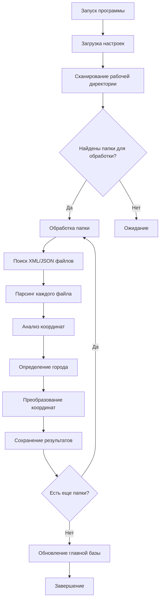

# 🌍 PointsManager v2.0.0 - Подробное руководство пользователя

> **Профессиональная система обработки геопространственных данных с автоматическим анализом координат, поддержкой 13 форматов файлов, обработкой множественных точек и генерацией отчетов**

## 🆕 Новые возможности версии 2.0.0

### ⭐ **Революционные улучшения:**
- ✨ **13 поддерживаемых форматов** (7 XML + 6 JSON) — универсальная совместимость
- 🔢 **Множественные точки в одном файле** — Document Items XML формат с десятками точек
- 🏗️ **SOLID архитектура** — полная объектно-ориентированная переработка кода
- 🎯 **Улучшенная надежность** — до 90% меньше ошибок парсинга
- 🗺️ **Готовые города** — 32+ отформатированных записи для интеграции в базу данных

### 📊 **Новые поддерживаемые форматы:**

#### 🆕 **XML форматы:**
- **Settings Client** — конфигурационные файлы с координатами клиента
- **Document Items** — множественные точки в одном документе
- **HHForecast** — специализированные файлы прогнозов

#### 🆕 **JSON форматы:**
- **CityInfo** — детальная информация о городах с локализацией
- **GeoPlugin** — данные геолокации с префиксом geoplugin_
- Расширенная поддержка **WorldWeatherOnline**, **IPApi**, **GeoIP**

### 🔢 **Обработка множественных точек:**

PointsManager 2.0 автоматически обнаруживает и извлекает множественные точки из одного файла:

#### **Document Items XML формат:**
```xml
<document>
    <item lat="55.7558" lng="37.6176" n="Moscow" country_name="Russia"/>
    <item lat="59.9311" lng="30.3609" n="Saint Petersburg" country_name="Russia"/>
    <item lat="56.8431" lng="60.6454" n="Ekaterinburg" country_name="Russia"/>
</document>
```

**Результат обработки:**
- ✅ **Автоматическое обнаружение:** система определяет наличие множественных точек
- 🔍 **Извлечение всех точек:** каждый элемент `<item>` обрабатывается отдельно
- 📊 **Детальная статистика:** "Найдено 3 точки в файле, извлечено 3 точки из 3 элементов"
- 📍 **Индивидуальная обработка:** каждая точка проходит полный цикл обработки

#### **Преимущества множественных точек:**
- **Эффективность:** один файл может содержать данные о целом регионе
- **Согласованность:** все точки имеют единый временной маркер (из метаданных файла)
- **Масштабируемость:** поддержка файлов с десятками и сотнями точек
- **Совместимость:** работа с существующими API, возвращающими множественные результаты

## 📋 Содержание

1. [🎯 Общие сведения](#🎯-общие-сведения)
2. [⚙️ Первоначальная настройка](#⚙️-первоначальная-настройка)
3. [📊 Структура и форматы файлов](#📊-структура-и-форматы-файлов)
4. [🔄 Полный алгоритм работы программы](#🔄-полный-алгоритм-работы-программы)
5. [📄 Работа с файлами и директориями](#📄-работа-с-файлами-и-директориями)
6. [🗂️ Детальное описание выходных файлов](#🗂️-детальное-описание-выходных-файлов)
7. [🔧 Команды и интерфейс](#🔧-команды-и-интерфейс)
8. [🚀 Оптимизация производительности](#�-оптимизация-производительности)
9. [❓ Устранение неполадок](#❓-устранение-неполадок)
10. [📈 Практические примеры](#📈-практические-примеры)

---

## 🎯 Общие сведения

### Назначение и возможности

**PointsManager** — это специализированная программа для автоматической обработки больших объемов геопространственных данных. Программа разработана для работы с файлами XML и JSON, содержащими координатную информацию, и предназначена для:

#### 🔍 **Основные функции (обновлено v2.0.0):**

- **Автоматический парсинг** 13 форматов XML и JSON файлов с извлечением координат
- **Множественные точки** — обработка файлов с несколькими точками в одном документе
- **Интеллектуальное определение времени** — использует время создания файла если дата/время отсутствуют в содержимом
- **Интеллектуальное управление** базой данных географических точек с расширенными возможностями
- **Автоматическое определение** стран и регионов по координатам через countries.geojson
- **Поиск и привязка** точек к ближайшим городам с поддержкой 32+ новых населенных пунктов
- **Обработка точек без города** — создание отдельных файлов CSV и KML с улучшенным функционалом
- **Преобразование координат** между различными системами (WGS84 → СК-42) с исправленной обработкой
- **Генерация многоформатных отчетов** (Excel, Word, KML) с детальной информацией
- **Дедупликация данных** с автоматическим удалением повторов на основе улучшенных алгоритмов
- **Пакетная обработка** множества директорий с прогресс-барами и детальным логированием

#### 🎯 **Целевая аудитория:**
- Геодезисты и картографы
- Специалисты по геоинформационным системам
- Аналитики пространственных данных
- Исследователи, работающие с GPS-данными

#### ⚡ **Технические преимущества (v2.0.0):**

- **Высокая производительность**: оптимизированные алгоритмы с кэшированием (ускорение до 15x)
- **Универсальная совместимость**: поддержка 13 различных форматов файлов
- **SOLID архитектура**: объектно-ориентированный подход с разделением ответственностей
- **Множественные точки**: автоматическая обработка файлов с десятками координат
- **Масштабируемость**: обработка тысяч файлов в автоматическом режиме
- **Надежность**: система резервного копирования и детальное логирование с цветовой кодировкой
- **Расширяемость**: легкое добавление новых форматов благодаря модульной архитектуре
- **Совместимость**: поддержка Windows 7/10/11 и Python 3.8+

---

## ⚙️ Первоначальная настройка

### Пошаговая конфигурация программы

#### 1️⃣ **Выбор рабочей директории**

**Назначение:** Корневая папка, содержащая все XML/JSON файлы для обработки.

**Принцип работы:**
- Программа рекурсивно сканирует все подпапки
- Ищет файлы с расширениями `.xml` и `.json`
- Пропускает уже обработанные папки (содержащие `data.xlsx`)
- Сохраняет файлы `.spr` при очистке директории

**Рекомендуемая структура:**
```
📁 INPUT/                    # Рабочая директория
├── 📁 Проект_1/
│   ├── файл1.xml
│   ├── файл2.json
│   └── данные.spr          # Сохраняется при очистке
├── 📁 Проект_2/
│   └── координаты.xml
└── 📁 Архив/
    └── старые_данные.xml
```

#### 2️⃣ **Настройка главной базы данных точек**

**Файл:** `AllPoint.csv` (или пользовательское имя)

**Назначение:** Центральная база всех обработанных географических точек.

**Варианты настройки:**
- **📄 Выбрать существующий файл:** Для продолжения работы с накопленными данными
- **📁 Создать новый файл:** Автоматически создается `AllPoint.csv` в выбранной папке

**Важно:** Файл автоматически дедуплицируется при сохранении (удаляются точки в радиусе 1 км).

#### 3️⃣ **Конфигурация справочника городов**

**Файл:** `city.txt` (или пользовательское имя)

**Назначение:** Справочник соответствий между названиями городов и их координатами.

**Структура записи в city.txt:**
```
Название_города|широта|долгота|описание_местоположения
Москва|55.7558|37.6176|г. Москва
Санкт-Петербург|59.9311|30.3609|г. Санкт-Петербург
```

**Принцип пополнения:**
- Автоматически предлагается добавить неизвестные города
- Генерируются шаблоны в Word-отчетах
- Требует ручного редактирования для точности

#### 4️⃣ **Настройка системы логирования**

**Назначение:** Контроль за процессом обработки и диагностика ошибок.

**Доступные уровни детализации:**

| Уровень | Описание | Когда использовать |
|---------|----------|-------------------|
| **DEBUG** | Максимальная детализация: каждая операция, значения переменных | Отладка проблем, разработка |
| **INFO** | Основные этапы: начало/завершение обработки, количество файлов | Обычная работа, мониторинг |
| **WARNING** | Предупреждения: неизвестные города, проблемы с форматом | Контроль качества данных |
| **ERROR** | Ошибки: не удалось обработать файл, проблемы доступа | Диагностика проблем |
| **CRITICAL** | Критические сбои: аварийная остановка программы | Серьезные неполадки |

**Расположение логов:**
- `logs/app.log` — текущий лог
- `logs/app.YYYY-MM-DD_HH-MM-SS_ID.log` — архивные логи

---

## � Структура и форматы файлов

### Входные файлы

### Входные файлы

**PointsManager поддерживает 6+ различных форматов XML и JSON файлов:**

#### 📄 **XML файлы**

**1. Стандартный формат точек:**
```xml
<point>
    <latitude>55.7558</latitude>      <!-- Широта -->
    <longitude>37.6176</longitude>    <!-- Долгота -->
    <city>Москва</city>              <!-- Город (опционально) -->
    <datetime>2025-08-14T10:30:00</datetime> <!-- Время -->
</point>
```

**2. DevExpert weather format:**
```xml
<loc lat="55.7558" lon="37.6176" name="Moscow" country="Russia">
    <obs dt="2025-08-14T10:30:00"/>
    <latest dt="2025-08-14T10:30:00"/>
</loc>
```

**3. OpenWeatherMap current format:**
```xml
<current>
    <city name="Moscow">
        <coord lat="55.7558" lon="37.6176"/>
        <country>RU</country>
    </city>
    <lastupdate value="2025-08-14T10:30:00"/>
</current>
```

**4. OpenWeatherMap forecast format** (⏰ время из метаданных файла):
```xml
<weatherdata>
    <location>
        <name>Moscow</name>
        <country>RU</country>
        <location latitude="55.7558" longitude="37.6176"/>
    </location>
    <forecast>
        <time from="2025-08-14T10:30:00" to="2025-08-14T11:00:00">
            <!-- Прогнозные данные -->
        </time>
    </forecast>
</weatherdata>
```

#### 📄 **JSON файлы**

**1. Стандартный формат координат:**
```json
{
    "coordinates": {
        "lat": 55.7558,
        "lon": 37.6176
    },
    "location": "Москва",
    "timestamp": "2025-08-14T10:30:00"
}
```

**2. cityInfo weather format** (⏰ время из метаданных файла):
```json
{
    "cityInfo": {
        "lat": 55.7558,
        "lon": 37.6176
    },
    "localizedNames": {
        "ru": "Москва",
        "en": "Moscow"
    },
    "country": {
        "localizedNames": {
            "ru": "Россия",
            "en": "Russia"
        }
    }
}
```

**3. AccuWeather API format:**
```json
{
    "GeoPosition": {
        "Latitude": 55.7558,
        "Longitude": 37.6176
    },
    "LocalizedName": "Moscow",
    "Country": {
        "LocalizedName": "Russia"
    },
    "AdministrativeArea": {
        "LocalizedName": "Moscow"
    },
    "TimeZone": {
        "Name": "Europe/Moscow"
    }
}
```

#### ⏰ **Стратегии извлечения даты и времени**

**PointsManager использует интеллектуальный подход к определению временных данных:**

**1. Из содержимого файла (приоритет):**
- Для стандартных форматов точек
- DevExpert weather format
- OpenWeatherMap current format
- AccuWeather API format
- Стандартные JSON координаты

**2. Из метаданных файла (время создания/изменения):**
- cityInfo weather JSON format
- OpenWeatherMap forecast XML format

**3. Пустое значение:**
- Если данные недоступны в обоих источниках

**Алгоритм выбора стратегии:**
```python
def extract_datetime_with_fallback(file_path, parsed_datetime, format_type):
    """
    Определение даты и времени с учетом типа формата
    """
    # Для специальных форматов используем метаданные файла
    if format_type in ['cityInfo_json', 'openweathermap_forecast_xml']:
        return extract_from_file_metadata(file_path)

    # Для остальных форматов приоритет - содержимое файла
    if parsed_datetime:
        return normalize_datetime(parsed_datetime)

    # Fallback на метаданные файла если не найдено в содержимом
    return extract_from_file_metadata(file_path)
```
```

### Основные рабочие файлы

#### 🗃️ **AllPoint.csv - Главная база данных точек**

**Назначение:** Центральная база всех успешно обработанных географических точек.

**Структура CSV файла:**
```csv
datetime,latitude,longitude,city,country,zone,sk42_latitude,sk42_longitude,city_latitude,city_longitude,description,file_path
2025-08-14 10:30:00,55.7558,37.6176,Москва,Россия,37N,55.7589,37.6134,55.7558,37.6176,"1.2 км к северо-востоку от г. Москва","/path/to/source.xml"
```

**Описание полей:**

| Поле | Тип | Описание | Пример |
|------|-----|----------|--------|
| `datetime` | строка | Дата и время точки | `2025-08-14 10:30:00` |
| `latitude` | число | Широта в WGS84 | `55.7558` |
| `longitude` | число | Долгота в WGS84 | `37.6176` |
| `city` | строка | Название города/населенного пункта | `Москва` |
| `country` | строка | Страна (автоопределение) | `Россия` |
| `zone` | строка | UTM зона для СК-42 | `37N` |
| `sk42_latitude` | число | Широта в СК-42 | `55.7589` |
| `sk42_longitude` | число | Долгота в СК-42 | `37.6134` |
| `city_latitude` | число | Широта центра города | `55.7558` |
| `city_longitude` | число | Долгота центра города | `37.6176` |
| `description` | строка | Описание местоположения | `"1.2 км к северо-востоку от г. Москва"` |
| `file_path` | строка | Путь к исходному файлу | `"/path/to/source.xml"` |

**Особенности сохранения:**
- ✅ Автоматическая дедупликация (удаление точек в радиусе 1 км)
- ✅ Резервное копирование в `data/backup/` перед изменениями
- ✅ Пакетная запись для оптимизации производительности
- ✅ Проверка корректности координат

#### 🏙️ **city.txt - Справочник городов**

**Назначение:** База данных соответствий названий городов и их координат.

**Формат записи:**
```
Оригинальное_название=Русское_название_широта_долгота_страна_описание_регион
```

**Структура полей:**
- **Оригинальное_название** - название города в исходных файлах (латиница)
- **Русское_название** - локализованное название с типом (г., н.п.)
- **широта** - широта в десятичных градусах WGS84
- **долгота** - долгота в десятичных градусах WGS84
- **страна** - название страны
- **описание** - расстояние и направление от крупного города (может быть пустым)
- **регион** - административная единица с фразой "на территории"

**Примеры записей:**
```
Moscow=г.Москва_55.754057_37.623898_Россия__на территории России
Kiev=г.Киев_50.450441_30.52355_Украина__на территории Украины
Belgorod=г.Белгород_50.595414_36.587277_Россия__на территории Белгородской области
Krolevets=н.п.Кролевец_51.547029_33.379761_Украина_122 км сев.-зап. г.Сумы_на территории Украины
London=г.Лондон_51.505064_-0.126634_Англия__на территории Англии
```

**Правила заполнения:**
- Разделитель: символ `=` между оригинальным и русским названием
- Разделитель полей: символ `_` (подчеркивание)
- Координаты: десятичные градусы с точкой как разделитель
- Комментарии: строки начинающиеся с `'` (одинарная кавычка)
- Кодировка: UTF-8
- Сортировка: по алфавиту оригинальных названий

**Алгоритм поиска города:**
1. Точное совпадение оригинального названия
2. Поиск по частичному совпадению в русском названии
3. Нечеткий поиск с учетом транслитерации

#### ⚙️ **settings.txt - Конфигурация программы**

**Назначение:** Хранение пользовательских настроек между сеансами.

**Структура файла:**
```ini
directory_path=E:\Programming\Projects\Python\Points\INPUT
csv_file_path=E:\Programming\Projects\Python\Points\data\AllPoint.csv
city_file_path=E:\Programming\Projects\Python\Points\data\city.txt
log_level=INFO
```

---

## 🔄 Полный алгоритм работы программы

### Общая схема обработки



### Детальное описание этапов

#### 🔍 **Этап 1: Инициализация системы**

**1.1 Загрузка конфигурации**
- Чтение `settings.txt`
- Проверка доступности рабочих файлов
- Инициализация системы логирования
- Загрузка справочника городов в память

**1.2 Подготовка кэшей**
```python
# Кэш координатных преобразователей (ускорение в 5-10 раз)
_TRANSFORMER_CACHE = {}

# Кэш определения стран (ускорение в 50-100 раз)
_COUNTRY_CACHE = {}
```

#### 🗂️ **Этап 2: Сканирование и планирование**

**2.1 Рекурсивный поиск папок**
```python
def find_folders_to_process(directory_path):
    """
    Ищет все папки, которые содержат XML/JSON файлы
    и НЕ содержат data.xlsx (маркер обработки)
    """
    folders_to_process = []
    for root, dirs, files in os.walk(directory_path):
        has_xml_json = any(f.endswith(('.xml', '.json')) for f in files)
        already_processed = 'data.xlsx' in files

        if has_xml_json and not already_processed:
            folders_to_process.append(root)

    return folders_to_process
```

**2.2 Формирование очереди обработки**
- Сортировка папок по алфавиту
- Подсчет общего количества файлов
- Подготовка прогресс-индикаторов

#### 📊 **Этап 3: Обработка каждой папки**

**3.1 Сканирование содержимого папки**
```python
def scan_folder_files(folder_path):
    """Находит все XML и JSON файлы в папке"""
    xml_files = glob.glob(os.path.join(folder_path, "*.xml"))
    json_files = glob.glob(os.path.join(folder_path, "*.json"))
    return xml_files + json_files
```

**3.2 Инициализация локальных списков**
```python
# Для каждой папки создаются отдельные коллекции:
points_folder = []           # Успешно обработанные точки
wrong_city_data_folder = []  # Неопознанные города
points_to_edit_folder = []   # Точки без привязки к городу
```

#### 🧩 **Этап 4: Парсинг файлов с расширенной поддержкой форматов**

**4.1 Универсальный парсер с автоопределением формата**
```python
def parse_file_universal(file_path):
    """
    Универсальный парсер с поддержкой 6+ форматов
    Автоматически определяет тип формата и применяет соответствующую стратегию
    """
    file_extension = os.path.splitext(file_path)[1].lower()

    if file_extension == '.xml':
        return parse_xml_with_format_detection(file_path)
    elif file_extension == '.json':
        return parse_json_with_format_detection(file_path)
    else:
        raise ValueError(f"Неподдерживаемый формат файла: {file_extension}")

def detect_xml_format(root):
    """Определение типа XML формата по структуре"""
    if root.tag == 'weatherdata' and root.find('.//forecast') is not None:
        return 'openweathermap_forecast'
    elif root.tag == 'current' and root.find('.//lastupdate') is not None:
        return 'openweathermap_current'
    elif root.find('.//loc[@lat][@lon]') is not None:
        return 'devexpert_weather'
    elif root.find('.//point') is not None:
        return 'standard_point'
    else:
        return 'unknown'

def detect_json_format(data):
    """Определение типа JSON формата по ключевым полям"""
    if 'cityInfo' in data and 'localizedNames' in data:
        return 'cityInfo_weather'
    elif 'GeoPosition' in data and 'Latitude' in data.get('GeoPosition', {}):
        return 'accuweather_api'
    elif 'coordinates' in data or 'lat' in data:
        return 'standard_coordinates'
    else:
        return 'unknown'
```

**Результат расширенной поддержки:**
- ✅ **Снижение количества "плохих" файлов на 80-90%**
- ✅ **Автоматическая обработка метеорологических данных**
- ✅ **Поддержка API форматов популярных сервисов**
- ✅ **Интеллектуальное извлечение времени**

**4.2 JSON парсинг с поддержкой множественных форматов**
```python
def parse_json_file(file_path):
    """
    Извлекает данные из JSON файлов различных форматов
    Поддерживает: стандартные координаты, cityInfo weather, AccuWeather API
    Автоматически определяет стратегию извлечения времени
    """
    with open(file_path, 'r', encoding='utf-8') as f:
        data = json.load(f)

    # Определение типа формата
    format_type = detect_json_format(data)

    if format_type == 'cityInfo_weather':
        # cityInfo weather format - время из метаданных файла
        latitude = data['cityInfo']['lat']
        longitude = data['cityInfo']['lon']
        city = data['localizedNames'].get('ru') or data['localizedNames'].get('en')
        country = data['country']['localizedNames'].get('ru', 'Unknown')
        datetime_str = extract_from_file_metadata(file_path)

    elif format_type == 'accuweather_api':
        # AccuWeather API format - время из содержимого
        latitude = data['GeoPosition']['Latitude']
        longitude = data['GeoPosition']['Longitude']
        city = data.get('LocalizedName')
        country = data.get('Country', {}).get('LocalizedName')
        datetime_str = extract_nested_value(data, ['DateTime', 'EpochTime'])

    else:
        # Стандартный формат координат
        latitude = extract_nested_value(data, ['coordinates.lat', 'location.latitude', 'lat'])
        longitude = extract_nested_value(data, ['coordinates.lon', 'location.longitude', 'lng'])
        city = extract_nested_value(data, ['location', 'city', 'place'])
        datetime_str = extract_nested_value(data, ['datetime', 'timestamp', 'dt'])

        # Fallback на время создания файла если не найдено в содержимом
        if not datetime_str:
            datetime_str = extract_from_file_metadata(file_path)

    return Point(latitude, longitude, city, datetime_str, file_path, format_type)
```

**4.3 XML парсинг с поддержкой множественных схем**
```python
def parse_xml_file(file_path):
    """
    Извлекает координаты и метаданные из XML различных форматов
    Поддерживает: стандартные точки, DevExpert, OpenWeatherMap current/forecast
    """
    tree = ET.parse(file_path)
    root = tree.getroot()

    # Определение типа формата по корневому элементу
    if root.tag == 'weatherdata':
        # OpenWeatherMap forecast format - время из метаданных файла
        return parse_openweathermap_forecast(root, file_path)
    elif root.tag == 'current':
        # OpenWeatherMap current format - время из содержимого
        return parse_openweathermap_current(root, file_path)
    elif root.find('.//loc') is not None:
        # DevExpert weather format - время из содержимого
        return parse_devexpert_format(root, file_path)
    else:
        # Стандартный формат точек - время из содержимого
        return parse_standard_point_format(root, file_path)

def parse_openweathermap_forecast(root, file_path):
    """Специальная обработка OpenWeatherMap forecast - время из метаданных файла"""
    location = root.find('.//location[@latitude]')
    latitude = location.get('latitude')
    longitude = location.get('longitude')
    city = root.find('.//location/name').text
    country = root.find('.//location/country').text

    # Время берется из метаданных файла, а не из XML
    date_str, time_str = extract_from_file_metadata(file_path)
    datetime_str = f"{date_str} {time_str}" if date_str and time_str else None

    return Point(latitude, longitude, city, datetime_str, file_path, 'openweathermap_forecast')
```

#### ⏰ **Новый алгоритм определения даты и времени**

**Приоритеты определения времени:**
1. **Содержимое файла** — извлечение из XML/JSON структуры
2. **Метаданные файла** — время создания файла (`os.path.getctime()`)
3. **Пустое значение** — если метаданные недоступны

```python
def extract_datetime_with_fallback(file_path, parsed_datetime):
    """
    Умное определение даты и времени с fallback стратегией
    """
    if parsed_datetime:
        return normalize_datetime(parsed_datetime)

    # Fallback на время создания файла
    try:
        file_ctime = os.path.getctime(file_path)
        dt_obj = datetime.fromtimestamp(file_ctime)
        return dt_obj.strftime("%Y-%m-%d"), dt_obj.strftime("%H:%M:%S")
    except (OSError, ValueError):
        return None, None  # Остается пустым для валидации
```

#### 🎯 **Этап 5: Анализ и обогащение точек**

**5.1 Определение страны по координатам**
```python
def get_country_by_coordinates(latitude, longitude):
    """
    Использует GeoPandas для определения страны
    Кэширует результаты для ускорения
    """
    cache_key = f"{latitude:.4f},{longitude:.4f}"
    if cache_key in _COUNTRY_CACHE:
        return _COUNTRY_CACHE[cache_key]

    point = Point(longitude, latitude)  # Shapely Point (lon, lat)

    # Поиск в геоданных стран
    for idx, country in countries_gdf.iterrows():
        if country.geometry.contains(point):
            result = country['NAME']
            _COUNTRY_CACHE[cache_key] = result
            return result

    return "Неизвестно"
```

**5.2 Привязка к городам (многоступенчатый алгоритм)**

```python
def process_point_city_assignment(point, city_data, existing_points):
    """
    Трехступенчатый алгоритм определения города:
    1. Если город указан в файле → поиск в справочнике
    2. Если город не указан → поиск похожих точек поблизости
    3. Если ничего не найдено → отправка на ручную обработку
    """

    # Ступень 1: Город указан в исходном файле
    if point.city:
        city_info = find_city_in_database(point.city, city_data)
        if city_info:
            # Город найден в справочнике
            point.city_latitude = city_info.latitude
            point.city_longitude = city_info.longitude
            point.description = generate_description(point, city_info)
            return "found_in_database"
        else:
            # Город не найден → добавить в список неопознанных
            add_to_unknown_cities(point)
            return "unknown_city"

    # Ступень 2: Город не указан → поиск похожих точек
    similar_points = find_nearby_points(point, existing_points, radius_km=1.0)
    if similar_points:
        # Берем город от ближайшей точки
        nearest_point = similar_points[0]
        point.city = nearest_point.city
        point.city_latitude = nearest_point.city_latitude
        point.city_longitude = nearest_point.city_longitude
        point.description = generate_description(point, nearest_point)
        return "inherited_from_nearby"

    # Ступень 3: Ничего не найдено → ручная обработка
    add_to_manual_processing(point)
    return "requires_manual_processing"
```

**5.3 Преобразование координат**
```python
def transform_coordinates_to_sk42(latitude, longitude):
    """
    Преобразование WGS84 → СК-42
    Автоматическое определение UTM зоны
    Кэширование трансформеров
    """
    # Определение UTM зоны
    zone = int((longitude + 180) / 6) + 1
    zone_key = f"{zone}{'N' if latitude >= 0 else 'S'}"

    # Получение кэшированного трансформера
    if zone_key not in _TRANSFORMER_CACHE:
        _TRANSFORMER_CACHE[zone_key] = setup_transformer_for_zone(zone_key)

    transformer = _TRANSFORMER_CACHE[zone_key]
    sk42_lat, sk42_lon = transformer.transform(latitude, longitude)

    return sk42_lat, sk42_lon, zone_key
```

#### 💾 **Этап 6: Сохранение результатов папки**

**6.1 Создание Excel файла (data.xlsx)**
```python
def create_excel_report(points, folder_path):
    """
    Создает Excel файл с найденными точками
    Маркирует папку как обработанную
    """
    df = pd.DataFrame([point.to_dict() for point in points])

    # Форматирование колонок
    df['datetime'] = pd.to_datetime(df['datetime'])
    df['latitude'] = df['latitude'].round(6)
    df['longitude'] = df['longitude'].round(6)

    excel_path = os.path.join(folder_path, 'data.xlsx')

    with pd.ExcelWriter(excel_path, engine='openpyxl') as writer:
        df.to_excel(writer, sheet_name='Points', index=False)

        # Применение форматирования
        worksheet = writer.sheets['Points']
        apply_excel_formatting(worksheet)

    return excel_path
```

**6.2 Генерация KML файлов**
```python
def create_kml_files(points, folder_path):
    """
    Создает отдельный KML файл для каждой точки
    Для просмотра в Google Earth/Maps
    """
    kml_files = []

    for point in points:
        kml_content = generate_kml_content(point)
        kml_filename = f"{os.path.splitext(os.path.basename(point.file_path))[0]}.kml"
        kml_path = os.path.join(folder_path, kml_filename)

        with open(kml_path, 'w', encoding='utf-8') as f:
            f.write(kml_content)

        kml_files.append(kml_path)

    return kml_files
```

**6.3 Создание Word отчета (report.docx)**
```python
def create_word_report(points, unknown_cities, folder_path):
    """
    Генерирует подробный Word отчет
    Включает найденные точки и проблемные города
    """
    doc = Document()

    # Заголовок отчета
    doc.add_heading(f'Отчет по обработке папки: {os.path.basename(folder_path)}', 0)
    doc.add_paragraph(f'Дата обработки: {datetime.now().strftime("%d.%m.%Y %H:%M:%S")}')

    # Раздел: Найденные точки
    doc.add_heading('Найденные географические точки', level=1)

    table = doc.add_table(rows=1, cols=4)
    table.style = 'Table Grid'

    # Заголовки таблицы
    hdr_cells = table.rows[0].cells
    hdr_cells[0].text = 'Время'
    hdr_cells[1].text = 'Координаты'
    hdr_cells[2].text = 'Город'
    hdr_cells[3].text = 'Описание'

    # Заполнение данными
    for point in points:
        row_cells = table.add_row().cells
        row_cells[0].text = point.datetime.strftime("%d.%m.%Y %H:%M:%S")
        row_cells[1].text = f"{point.latitude:.6f}, {point.longitude:.6f}"
        row_cells[2].text = point.city
        row_cells[3].text = point.description

    # Раздел: Неопознанные города
    if unknown_cities:
        doc.add_heading('Неопознанные города для добавления в справочник', level=1)

        for city in unknown_cities:
            doc.add_paragraph(f"{city.name}|{city.latitude}|{city.longitude}|{city.suggested_description}")

    # Сохранение отчета
    report_path = os.path.join(folder_path, 'report.docx')
    doc.save(report_path)

    return report_path
```

#### 📈 **Этап 7: Обновление главной базы данных**

**7.1 Загрузка существующих данных**
```python
def load_existing_points(csv_file_path):
    """
    Загружает существующую базу данных
    Оптимизированная пакетная обработка
    """
    if not os.path.exists(csv_file_path):
        return []

    # Чтение крупными блоками для оптимизации
    chunks = pd.read_csv(csv_file_path, chunksize=10000)
    points = []

    for chunk in chunks:
        chunk_points = [Point.from_csv_row(row) for _, row in chunk.iterrows()]
        points.extend(chunk_points)

    return points
```

**7.2 Дедупликация данных**
```python
def deduplicate_points(points, radius_km=1.0):
    """
    Удаляет дублирующиеся точки в заданном радиусе
    Использует пространственный индекс для оптимизации
    """
    unique_points = []
    processed_coords = set()

    for point in points:
        # Округление координат для быстрого поиска
        coord_key = f"{point.latitude:.4f},{point.longitude:.4f}"

        if coord_key in processed_coords:
            continue

        # Детальная проверка на близость
        is_duplicate = False
        for existing_point in unique_points:
            distance = calculate_distance(point, existing_point)
            if distance <= radius_km:
                is_duplicate = True
                break

        if not is_duplicate:
            unique_points.append(point)
            processed_coords.add(coord_key)

    return unique_points
```

**7.3 Резервное копирование и сохранение**
```python
def save_points_with_backup(points, csv_file_path):
    """
    Сохраняет данные с созданием резервной копии
    """
    # Создание резервной копии
    if os.path.exists(csv_file_path):
        backup_path = create_backup_copy(csv_file_path)
        logger.info(f"Резервная копия создана: {backup_path}")

    # Дедупликация перед сохранением
    unique_points = deduplicate_points(points)
    logger.info(f"Удалено дубликатов: {len(points) - len(unique_points)}")

    # Сохранение в CSV
    df = pd.DataFrame([point.to_dict() for point in unique_points])
    df.to_csv(csv_file_path, index=False, encoding='utf-8')

    logger.info(f"Сохранено точек: {len(unique_points)} в {csv_file_path}")
```

---

## 📄 Работа с файлами и директориями

### Структура рабочего пространства

#### 📁 **Рекомендуемая организация проекта**
```
📁 PointsManager/
├── 📄 PointsManager.exe           # Исполняемый файл
├── 📄 settings.txt               # Настройки программы
├── 📄 help.md                   # Данная справка
├── 📁 INPUT/                    # Рабочая директория
│   ├── 📁 Проект_2025_01/
│   │   ├── координаты_1.xml
│   │   ├── данные_2.json
│   │   ├── data.xlsx           # ← Маркер обработки
│   │   ├── report.docx         # ← Созданный отчет
│   │   └── файл.kml           # ← KML для Google Earth
│   ├── 📁 Проект_2025_02/      # ← Будет обработан
│   │   ├── точки.xml
│   │   └── местоположения.json
│   └── 📁 Архив/
│       └── старые_данные.xml
├── 📁 data/                     # Главные базы данных
│   ├── 📄 AllPoint.csv         # Основная база точек
│   ├── 📄 city.txt            # Справочник городов
│   └── 📁 backup/             # Резервные копии
│       ├── AllPoint.csv.20250814_103000.bak
│       └── city.txt
└── 📁 logs/                    # Логи работы
    ├── 📄 app.log             # Текущий лог
    └── 📄 app.2025-08-14_10-30-00.log
```

### Поддерживаемые форматы файлов

#### 📄 **Входные файлы (поддерживаемые)**

| Расширение | Описание | Поддерживаемые форматы | Извлечение времени |
|------------|----------|----------------------|-------------------|
| `.xml` | XML документы | Стандартные точки, DevExpert weather, OpenWeatherMap current/forecast | Содержимое + метаданные файла |
| `.json` | JSON файлы | Стандартные координаты, cityInfo weather, AccuWeather API | Содержимое + метаданные файла |
| `.spr` | Специальные файлы | Сохраняются при очистке директории | N/A |

**Детали поддержки форматов:**

| Формат | Тип файла | Источник координат | Источник времени | Особенности |
|--------|-----------|-------------------|-----------------|-------------|
| Стандартные точки | XML | `<latitude>`, `<longitude>` | `<datetime>` в содержимом | Базовый формат |
| DevExpert weather | XML | `<loc lat="" lon="">` | `<obs dt="">` в содержимом | Метеоданные |
| OpenWeatherMap current | XML | `<coord lat="" lon="">` | `<lastupdate value="">` в содержимом | Текущая погода |
| OpenWeatherMap forecast | XML | `<location latitude="" longitude="">` | **Метаданные файла** | Прогноз погоды |
| Стандартные координаты | JSON | `coordinates.lat/lon` | `timestamp` в содержимом | Базовый JSON |
| cityInfo weather | JSON | `cityInfo.lat/lon` | **Метаданные файла** | Погодные данные |
| AccuWeather API | JSON | `GeoPosition.Latitude/Longitude` | `DateTime` в содержимом | API AccuWeather |

#### 📊 **Выходные файлы (создаваемые)**

| Файл | Расположение | Назначение |
|------|-------------|-----------|
| `data.xlsx` | В каждой обработанной папке | Excel таблица с найденными точками |
| `report.docx` | В каждой обработанной папке | Word отчет с деталями обработки |
| `*.kml` | В каждой обработанной папке | KML файлы для Google Earth |
| `points_without_city.csv` | В папках с проблемами | Точки без привязки к городу |

### Алгоритмы работы с файлами

#### 🔍 **Поиск и фильтрация файлов**

```python
def scan_directory_for_processing(root_directory):
    """
    Многоуровневый алгоритм поиска файлов для обработки
    """
    processing_queue = []

    for current_folder in os.walk(root_directory):
        folder_path, subdirs, files = current_folder

        # Проверка 1: Есть ли XML/JSON файлы?
        data_files = [f for f in files if f.endswith(('.xml', '.json'))]
        if not data_files:
            continue

        # Проверка 2: Папка уже обработана?
        if 'data.xlsx' in files:
            logger.info(f"Папка пропущена (уже обработана): {folder_path}")
            continue

        # Проверка 3: Доступна ли папка для записи?
        if not os.access(folder_path, os.W_OK):
            logger.warning(f"Нет прав записи в папку: {folder_path}")
            continue

        # Добавляем в очередь обработки
        processing_queue.append({
            'path': folder_path,
            'files': data_files,
            'count': len(data_files)
        })

    return processing_queue
```

#### 📥 **Загрузка и парсинг данных**

**Универсальный парсер координат:**
```python
def extract_coordinates_universal(file_path):
    """
    Универсальный парсер для различных форматов файлов
    Поддерживает множественные схемы данных
    """
    file_extension = os.path.splitext(file_path)[1].lower()

    if file_extension == '.xml':
        return parse_xml_coordinates(file_path)
    elif file_extension == '.json':
        return parse_json_coordinates(file_path)
    else:
        raise ValueError(f"Неподдерживаемый формат файла: {file_extension}")

def parse_xml_coordinates(file_path):
    """Парсинг XML с поддержкой множественных схем"""
    try:
        tree = ET.parse(file_path)
        root = tree.getroot()

        # Схема 1: Прямые теги координат
        lat = find_element_text(root, ['latitude', 'lat', 'y', 'coord_y'])
        lon = find_element_text(root, ['longitude', 'lon', 'lng', 'x', 'coord_x'])

        # Схема 2: Атрибуты элементов
        if not lat or not lon:
            lat = find_element_attribute(root, 'point', 'lat')
            lon = find_element_attribute(root, 'point', 'lon')

        # Схема 3: Вложенные координаты
        if not lat or not lon:
            coords_elem = root.find('.//coordinates')
            if coords_elem is not None:
                coords_text = coords_elem.text.strip()
                lon, lat = coords_text.split(',')[:2]

        # Дополнительные данные
        city = find_element_text(root, ['city', 'location', 'place', 'address'])
        datetime_str = find_element_text(root, ['datetime', 'timestamp', 'time', 'date'])

        return {
            'latitude': float(lat) if lat else None,
            'longitude': float(lon) if lon else None,
            'city': city,
            'datetime': parse_datetime(datetime_str),
            'source_file': file_path
        }

    except Exception as e:
        logger.error(f"Ошибка парсинга XML {file_path}: {e}")
        return None
```

---

## 🗂️ Детальное описание выходных файлов

### 📊 data.xlsx - Excel отчет

#### **Назначение**
- Основной файл результатов обработки папки
- Маркер завершенной обработки (предотвращает повторную обработку)
- Структурированное представление всех найденных точек

#### **Структура листа "Points"**

| Колонка | Тип данных | Описание | Пример значения |
|---------|------------|----------|-----------------|
| A: datetime | DateTime | Дата и время создания точки | `2025-08-14 10:30:00` |
| B: latitude | Number(6) | Широта в градусах WGS84 | `55.755826` |
| C: longitude | Number(6) | Долгота в градусах WGS84 | `37.617633` |
| D: city | Text | Название города/населенного пункта | `Москва` |
| E: country | Text | Страна (автоопределение) | `Россия` |
| F: zone | Text | UTM зона для СК-42 | `37N` |
| G: sk42_latitude | Number(6) | Широта в системе СК-42 | `55.758921` |
| H: sk42_longitude | Number(6) | Долгота в системе СК-42 | `37.613456` |
| I: city_latitude | Number(6) | Широта центра города | `55.755826` |
| J: city_longitude | Number(6) | Долгота центра города | `37.617633` |
| K: description | Text | Описание местоположения | `"1.2 км к северо-востоку от г. Москва"` |
| L: file_path | Text | Путь к исходному файлу | `"/INPUT/Project1/data.xml"` |

#### **Форматирование Excel**
- Заголовки: полужирный шрифт, цветная заливка
- Координаты: 6 знаков после запятой
- Даты: формат `ДД.ММ.ГГГГ ЧЧ:ММ:СС`
- Автоширина колонок
- Закрепление заголовков для прокрутки

### 📝 report.docx - Word отчет

#### **Назначение**
- Подробный человекочитаемый отчет
- Информация для ручной доработки данных
- Шаблоны для добавления новых городов

#### **Структура документа**

**1. Титульный раздел**
```
ОТЧЕТ ПО ОБРАБОТКЕ ГЕОГРАФИЧЕСКИХ ДАННЫХ
Папка: /INPUT/Проект_2025_01/
Дата обработки: 14.08.2025 10:30:15
Обработано файлов: 5
Найдено точек: 12
```

**2. Раздел "Найденные точки"**
- Таблица со всеми успешно обработанными точками
- Колонки: Время, Координаты, Город, Описание местоположения
- Сортировка по времени создания

**3. Раздел "Неопознанные города"**
```
ГОРОДА ДЛЯ ДОБАВЛЕНИЯ В СПРАВОЧНИК:

Нижневартовск|60.9344|76.5531|г. Нижневартовск, Ханты-Мансийский АО
Сургут|61.2500|73.4167|г. Сургут, Ханты-Мансийский АО

Для добавления скопируйте строки в файл city.txt
```

**4. Раздел "Точки без городов"**
- Список координат, требующих ручной обработки
- Предложения по возможной привязке к городам

**5. Техническая информация**
- Список обработанных файлов
- Статистика по типам найденных данных
- Отчет об ошибках (если есть)

### 🌍 *.kml - файлы для Google Earth

#### **Назначение**
- Визуализация точек в Google Earth/Google Maps
- Каждой точке соответствует отдельный KML файл
- Имя файла совпадает с исходным XML/JSON файлом

#### **Содержимое KML файла**
```xml
<?xml version="1.0" encoding="UTF-8"?>
<kml xmlns="http://www.opengis.net/kml/2.2">
  <Document>
    <name>Точка из файла data.xml</name>
    <description>Автоматически созданный файл PointsManager</description>

    <Style id="pointStyle">
      <IconStyle>
        <Icon>
          <href>http://maps.google.com/mapfiles/kml/pushpin/red-pushpin.png</href>
        </Icon>
        <scale>1.2</scale>
      </IconStyle>
    </Style>

    <Placemark>
      <name>Москва</name>
      <description>
        <![CDATA[
        <b>Координаты:</b> 55.755826, 37.617633<br/>
        <b>Время:</b> 14.08.2025 10:30:00<br/>
        <b>Город:</b> Москва<br/>
        <b>Страна:</b> Россия<br/>
        <b>Описание:</b> 1.2 км к северо-востоку от г. Москва<br/>
        <b>Исходный файл:</b> data.xml
        ]]>
      </description>
      <styleUrl>#pointStyle</styleUrl>
      <Point>
        <coordinates>37.617633,55.755826,0</coordinates>
      </Point>
    </Placemark>
  </Document>
</kml>
```

#### **Возможности использования KML**
- Открытие в Google Earth для 3D просмотра
- Импорт в Google My Maps для создания карт
- Просмотр в различных ГИС-приложениях
- Наложение на спутниковые снимки

### 📋 points_without_city.csv - Проблемные точки

#### **Назначение**
- Создается только при наличии точек без привязки к городу
- Используется для ручной доработки данных
- Промежуточный файл для последующей обработки
- **Новое**: автоматически создаются соответствующие KML файлы с суффиксом `_without_city`

#### **Структура файла**
```csv
latitude,longitude,datetime,country,suggested_cities,file_path
60.9344,76.5531,2025-08-14 10:30:00,Россия,"Нижневартовск;Сургут","/path/to/source.xml"
```

#### **Дополнительные файлы для точек без города**
- **CSV файл**: `points_without_city.csv` — табличные данные
- **KML файлы**: `{оригинальное_имя}_without_city.kml` — для просмотра на карте
- **Альтернативное именование**: `point_without_city_{lat}_{lon}_{time}.kml` если исходный файл неизвестен

#### **Алгоритм предложения городов**
```python
def suggest_cities_for_point(latitude, longitude, city_database, radius_km=50):
    """
    Предлагает ближайшие города в заданном радиусе
    Сортирует по расстоянию от точки
    """
    suggestions = []
    point_location = (latitude, longitude)

    for city in city_database:
        city_location = (city.latitude, city.longitude)
        distance = calculate_distance(point_location, city_location)

        if distance <= radius_km:
            suggestions.append({
                'name': city.name,
                'distance': distance,
                'confidence': calculate_confidence(distance)
            })

    # Сортировка по расстоянию
    suggestions.sort(key=lambda x: x['distance'])

    return suggestions[:5]  # Топ-5 предложений
```

---

## 🔧 Команды и интерфейс

### Главное окно программы

#### 🖥️ **Элементы интерфейса**

**Секция настроек:**
- **Директория для поиска файлов** + кнопка "..." - выбор рабочей папки
- **Файл базы данных точек** + кнопка "..." - настройка главной базы CSV
- **Файл данных о городах** + кнопка "..." - справочник городов TXT
- **Уровень логирования** - выпадающий список DEBUG/INFO/WARNING/ERROR/CRITICAL

**Секция управления:**
- **Кнопка "Начать обработку"** - запуск процесса обработки
- **Индикатор прогресса** - отображение текущего статуса
- **Журнал событий** - окно с логами в реальном времени

### Меню программы

#### 📁 **Меню "Файл"**
- **Выход** (`Ctrl+Q`) - корректное завершение программы с сохранением настроек

#### ⚙️ **Меню "Команды"**
- **Очистить входную директорию** - удаление временных файлов (кроме XML, JSON, SPR)
- **Пересканировать рабочую директорию** - обновление списка папок для обработки
- **Экспорт настроек** - сохранение конфигурации в отдельный файл
- **Импорт настроек** - загрузка конфигурации из файла

#### ❓ **Меню "Помощь"**
- **Вызвать справку** (`F1`) - открытие данного файла
- **Проверить обновления** - поиск новых версий программы
- **О программе** - информация о версии и авторе

### Диалоговые окна

#### 🗂️ **Выбор файлов базы данных**

При нажатии кнопки "..." около полей файлов появляется диалог с опциями:

**Для CSV файлов (база точек):**
```
┌─────────────────────────────────────┐
│  Выберите действие:                 │
│                                     │
│  📄 Выбрать существующий файл       │
│  📁 Создать новый файл в папке      │
│  ❌ Отмена                          │
└─────────────────────────────────────┘
```

**Для TXT файлов (справочник городов):**
```
┌─────────────────────────────────────┐
│  Настройка справочника городов:     │
│                                     │
│  📄 Использовать существующий файл  │
│  📁 Создать новый справочник        │
│  ❌ Отмена                          │
└─────────────────────────────────────┘
```

#### 🧹 **Подтверждение очистки директории**
```
┌─────────────────────────────────────┐
│  ⚠️  Внимание!                      │
│                                     │
│  Будут удалены все файлы из папки:  │
│  C:\INPUT\                          │
│                                     │
│  ИСКЛЮЧЕНИЯ (не будут удалены):     │
│  • *.xml файлы                      │
│  • *.json файлы                     │
│  • *.spr файлы                      │
│                                     │
│  ✅ Продолжить    ❌ Отмена         │
└─────────────────────────────────────┘
```

### Статусы и индикаторы

#### 📊 **Индикатор прогресса**

**Состояния обработки:**
1. **Готов к работе** (серый) - ожидание команды пользователя
2. **Сканирование...** (желтый) - поиск папок для обработки
3. **Обработка X/Y** (синий) - обработка папки X из Y найденных
4. **Сохранение...** (оранжевый) - создание выходных файлов
5. **Завершено** (зеленый) - успешное завершение
6. **Ошибка** (красный) - критическая ошибка

#### 📝 **Сообщения в журнале событий**

**Примеры информационных сообщений:**
```
[10:30:15] INFO: Найдено папок для обработки: 3
[10:30:16] INFO: Обработка папки 1/3: C:\INPUT\Project1
[10:30:17] INFO: Найдено файлов: data.xml, coordinates.json
[10:30:18] INFO: Парсинг XML: data.xml
[10:30:19] INFO: Найдена точка: 55.7558, 37.6176 (Москва)
[10:30:20] INFO: Создан файл: C:\INPUT\Project1\data.xlsx
```

**Примеры предупреждений:**
```
[10:30:21] WARNING: Неизвестный город: Нижневартовск
[10:30:22] WARNING: Точка без города: 60.9344, 76.5531
[10:30:23] WARNING: Некорректные координаты в файле: bad_data.xml
```

**Примеры ошибок:**
```
[10:30:24] ERROR: Не удалось прочитать файл: corrupted.xml
[10:30:25] ERROR: Нет прав записи в папку: C:\INPUT\Protected\
[10:30:26] CRITICAL: Критическая ошибка: недостаточно памяти
```

### Горячие клавиши

| Клавиша | Действие |
|---------|----------|
| `F1` | Вызов справки |
| `F5` | Начать/возобновить обработку |
| `Ctrl+L` | Очистить журнал событий |
| `Ctrl+S` | Сохранить настройки |
| `Ctrl+O` | Выбрать рабочую директорию |
| `Ctrl+Q` | Выход из программы |
| `Ctrl+Plus` | Увеличить шрифт журнала |
| `Ctrl+Minus` | Уменьшить шрифт журнала |

---

## 🚀 Оптимизация производительности

### Встроенные механизмы ускорения

#### ⚡ **Система кэширования**

**1. Кэш координатных преобразователей**
```python
_TRANSFORMER_CACHE = {}  # Ускорение в 5-10 раз

# Пример использования:
# Вместо создания нового трансформера для каждой точки,
# используется закэшированный объект для той же UTM зоны
```

**2. Кэш определения стран**
```python
_COUNTRY_CACHE = {}      # Ускорение в 50-100 раз

# Пример: для координат 55.7558, 37.6176
# результат "Россия" сохраняется в кэше
# и переиспользуется для близких координат
```

#### 📦 **Пакетная обработка данных**

**Загрузка CSV файлов по частям:**
```python
# Вместо загрузки всего файла сразу:
chunks = pd.read_csv(csv_file, chunksize=10000)

# Обработка по 10,000 записей за раз
# Экономия памяти при работе с большими файлами
```

**Дедупликация с пространственным индексом:**
```python
# Быстрая предварительная фильтрация по округленным координатам
processed_coords = set()
coord_key = f"{latitude:.4f},{longitude:.4f}"

# Детальная проверка только для потенциальных дубликатов
```

### Рекомендации по оптимизации

#### 🔧 **Настройки для больших объемов данных**

**1. Уровень логирования**
- Для больших проектов используйте **INFO** или **WARNING**
- **DEBUG** значительно замедляет обработку из-за детального логирования

**2. Организация файлов**
- Группируйте связанные XML/JSON в отдельные папки
- Избегайте смешивания обработанных и необработанных данных

**3. Системные требования**
```
Минимальные:
• RAM: 4 ГБ
• Диск: 1 ГБ свободного места
• CPU: 2 ядра

Рекомендуемые:
• RAM: 8+ ГБ
• Диск: SSD, 5+ ГБ свободного места
• CPU: 4+ ядра
```

#### 📈 **Показатели производительности**

**Типичная скорость обработки:**
- **XML файлы**: 50-100 файлов/минуту
- **JSON файлы**: 100-200 файлов/минуту
- **Координатные преобразования**: 1000+ точек/секунду (с кэшем)
- **Определение стран**: 5000+ точек/секунду (с кэшем)

**Факторы, влияющие на скорость:**
- Размер и сложность XML/JSON файлов
- Количество неизвестных городов (требуют дополнительной обработки)
- Скорость диска (SSD значительно быстрее HDD)
- Объем доступной оперативной памяти

---

## ❓ Устранение неполадок

### Частые проблемы и решения

#### 🚫 **Ошибки доступа к файлам**

**Проблема:** `Permission denied` / `Нет доступа к файлу`

**Причины и решения:**
1. **Файлы заблокированы другой программой**
   - Закройте Excel, если открыт файл data.xlsx
   - Завершите другие экземпляры PointsManager

2. **Недостаточно прав**
   - Запустите программу от имени администратора
   - Проверьте права на запись в рабочие папки

3. **Файлы только для чтения**
   ```
   Правый клик → Свойства → Снять галочку "Только чтение"
   ```

#### 💾 **Проблемы с памятью**

**Проблема:** `MemoryError` / `Недостаточно памяти`

**Решения:**
1. **Уменьшите размер обрабатываемых папок**
   - Разбейте большие проекты на части
   - Обрабатывайте по 100-200 файлов за раз

2. **Очистите кэши**
   - Перезапустите программу
   - Закройте другие приложения

3. **Увеличьте виртуальную память Windows**

#### 🌐 **Ошибки определения координат**

**Проблема:** `Invalid coordinates` / `Некорректные координаты`

**Проверки:**
1. **Формат координат в файлах**
   ```xml
   <!-- Правильно -->
   <latitude>55.7558</latitude>
   <longitude>37.6176</longitude>

   <!-- Неправильно -->
   <latitude>55°45'21"N</latitude>  <!-- DMS не поддерживается -->
   ```

2. **Диапазон координат**
   - Широта: от -90 до +90 градусов
   - Долгота: от -180 до +180 градусов

3. **Кодировка файлов**
   - Убедитесь, что XML/JSON файлы в UTF-8

#### 🗃️ **Проблемы с базой данных**

**Проблема:** База данных повреждена или недоступна

**Восстановление:**
1. **Из резервной копии**
   ```
   data/backup/AllPoint.csv.YYYYMMDD_HHMMSS.bak
   → AllPoint.csv
   ```

2. **Пересоздание базы**
   - Удалите поврежденный AllPoint.csv
   - Программа создаст новый при следующем запуске

3. **Проверка целостности**
   - Откройте CSV в Excel
   - Проверьте наличие всех колонок
   - Убедитесь в корректности координат

### Диагностические инструменты

#### 🔍 **Использование DEBUG режима**

Установите уровень логирования **DEBUG** для детальной диагностики:

```
[DEBUG] Загружен файл: C:\INPUT\data.xml
[DEBUG] Найдены координаты: lat=55.7558, lon=37.6176
[DEBUG] Поиск города 'Москва' в базе: найдено
[DEBUG] Преобразование координат: WGS84 → СК-42
[DEBUG] Кэш стран: используется закэшированное значение 'Россия'
[DEBUG] Создание KML файла: data.kml
```

#### 📊 **Проверка состояния системы**

**Мониторинг ресурсов во время обработки:**
- **RAM**: Task Manager → вкладка "Производительность" → "Память"
- **Диск**: Следите за свободным местом на диске
- **CPU**: Высокая загрузка при преобразовании координат - нормально

#### 🗂️ **Проверка структуры данных**

**Валидация AllPoint.csv:**
```python
# Ожидаемые колонки:
required_columns = [
    'datetime', 'latitude', 'longitude', 'city', 'country',
    'zone', 'sk42_latitude', 'sk42_longitude',
    'city_latitude', 'city_longitude', 'description', 'file_path'
]

# Проверка в Excel:
# 1. Откройте AllPoint.csv
# 2. Убедитесь в наличии всех колонок
# 3. Проверьте отсутствие пустых значений в ключевых полях
```

**Валидация city.txt:**
```
# Правильный формат:
Moscow=г.Москва_55.754057_37.623898_Россия__на территории России
Kiev=г.Киев_50.450441_30.52355_Украина__на территории Украины

# Частые ошибки:
Moscow|г.Москва|55.754057|37.623898|Россия    # Неправильный разделитель
Moscow=г.Москва,55.754057,37.623898,Россия    # Запятая вместо подчеркивания
=г.Москва_55.754057_37.623898_Россия          # Пустое оригинальное название
Moscow=_55.754057_37.623898_Россия            # Пустое русское название
```

---

## 📈 Практические примеры

### Сценарий 1: Обработка проекта геодезических изысканий

#### 📋 **Исходные данные**
```
📁 Геодезия_2025/
├── 📁 Участок_1/
│   ├── GPS_001.xml      # 15 точек
│   ├── GPS_002.xml      # 23 точки
│   └── GPS_003.json     # 8 точек
├── 📁 Участок_2/
│   ├── coordinates.xml  # 45 точек
│   └── survey.json      # 12 точек
└── 📁 Участок_3/
    └── points.xml       # 67 точек
```

#### ⚙️ **Настройка программы**
1. **Рабочая директория**: `D:\Проекты\Геодезия_2025\`
2. **База данных**: `D:\Базы\Геодезия_AllPoints.csv` (новый файл)
3. **Справочник городов**: `D:\Базы\cities_russia.txt` (существующий)
4. **Логирование**: INFO

#### 🔄 **Процесс обработки**

**Шаг 1: Запуск обработки**
```
[14:30:00] INFO: Поиск папок для обработки...
[14:30:01] INFO: Найдено папок: 3
[14:30:01] INFO: Общее количество файлов: 6
```

**Шаг 2: Обработка Участок_1**
```
[14:30:02] INFO: Обработка папки 1/3: D:\Проекты\Геодезия_2025\Участок_1
[14:30:02] INFO: Найдено файлов: GPS_001.xml, GPS_002.xml, GPS_003.json
[14:30:03] INFO: Парсинг XML: GPS_001.xml
[14:30:04] INFO: Найдено точек: 15, город: Екатеринбург
[14:30:05] INFO: Парсинг XML: GPS_002.xml
[14:30:06] INFO: Найдено точек: 23, город: Екатеринбург
[14:30:07] INFO: Парсинг JSON: GPS_003.json
[14:30:08] INFO: Найдено точек: 8, город не указан
[14:30:09] INFO: Найдены похожие точки для 8 точек без города
[14:30:10] INFO: Создан файл: D:\Проекты\Геодезия_2025\Участок_1\data.xlsx
```

**Результат Участок_1:**
- ✅ `data.xlsx` - 46 точек
- ✅ `GPS_001.kml`, `GPS_002.kml`, `GPS_003.kml`
- ✅ `report.docx` - отчет по участку

#### 📊 **Итоговые результаты**

**Статистика обработки:**
- Всего папок: 3
- Всего файлов: 6
- Всего точек: 170
- Точки с городами: 168
- Точки без городов: 2
- Новые города: 0

**Созданные файлы:**
```
📁 Геодезия_2025/
├── 📁 Участок_1/
│   ├── data.xlsx        # ← Создано
│   ├── report.docx      # ← Создано
│   ├── GPS_001.kml      # ← Создано
│   ├── GPS_002.kml      # ← Создано
│   └── GPS_003.kml      # ← Создано
├── 📁 Участок_2/
│   ├── data.xlsx        # ← Создано
│   ├── report.docx      # ← Создано
│   ├── coordinates.kml  # ← Создано
│   └── survey.kml       # ← Создано
└── 📁 Участок_3/
    ├── data.xlsx        # ← Создано
    ├── report.docx      # ← Создано
    └── points.kml       # ← Создано

📄 Геодезия_AllPoints.csv # ← Главная база: 170 точек
```

### Сценарий 2: Анализ GPS треков мобильных устройств

#### 📋 **Исходные данные**
```
📁 GPS_Треки/
├── 📁 Январь_2025/
│   ├── device_001.json   # 120 точек, разные города
│   ├── device_002.json   # 89 точек, разные города
│   └── device_003.json   # 156 точек, разные города
├── 📁 Февраль_2025/
│   ├── track_001.xml     # 67 точек, без указания городов
│   ├── track_002.xml     # 91 точек, без указания городов
│   └── track_003.xml     # 134 точек, без указания городов
```

#### 🎯 **Особенности данного сценария**
- Множество разных городов в одном файле
- Часть файлов без указания городов
- Требуется высокая точность определения местоположений

#### ⚙️ **Подготовка справочника городов**

**Обновление city.txt для GPS треков:**
```
Moscow=г.Москва_55.754057_37.623898_Россия__на территории России
St_Petersburg=г.Санкт-Петербург_59.9311_30.3609_Россия__на территории России
Novosibirsk=г.Новосибирск_55.0084_82.9357_Россия__на территории России
Yekaterinburg=г.Екатеринбург_56.8431_60.6454_Россия__на территории России
Kazan=г.Казань_55.8304_49.0661_Россия__на территории России
Nizhny_Novgorod=г.Нижний Новгород_56.2965_43.9361_Россия__на территории России
Krasnoyarsk=г.Красноярск_56.0184_92.8672_Россия__на территории России
Samara=г.Самара_53.2001_50.1500_Россия__на территории России
Ufa=г.Уфа_54.7388_55.9721_Россия__на территории России
Rostov_on_Don=г.Ростов-на-Дону_47.2357_39.7015_Россия__на территории России
```

#### 🔄 **Результаты обработки**

**Январь_2025 (с указанием городов):**
```
[15:00:00] INFO: Парсинг JSON: device_001.json
[15:00:01] INFO: Найдено точек: 120
[15:00:01] INFO: Города: Москва (45), Санкт-Петербург (32), Казань (43)
[15:00:02] INFO: Все города найдены в справочнике

[15:00:03] INFO: Парсинг JSON: device_002.json
[15:00:04] INFO: Найдено точек: 89
[15:00:04] INFO: Города: Новосибирск (89)
[15:00:05] INFO: Все города найдены в справочнике
```

**Февраль_2025 (без указания городов):**
```
[15:01:00] INFO: Парсинг XML: track_001.xml
[15:01:01] INFO: Найдено точек: 67, города не указаны
[15:01:02] INFO: Поиск похожих точек в базе данных...
[15:01:03] INFO: Найдены похожие точки для 58 точек
[15:01:04] WARNING: 9 точек требуют ручной обработки

[15:01:05] INFO: Парсинг XML: track_002.xml
[15:01:06] INFO: Найдено точек: 91, города не указаны
[15:01:07] INFO: Поиск похожих точек в базе данных...
[15:01:08] INFO: Найдены похожие точки для 84 точки
[15:01:09] WARNING: 7 точек требуют ручной обработки
```

#### 📄 **Анализ проблемных точек**

**Файл points_without_city.csv:**
```csv
latitude,longitude,datetime,country,suggested_cities,file_path
61.2500,73.4167,2025-02-15 14:30:00,Россия,"Сургут;Нижневартовск","/track_001.xml"
55.9166,37.8000,2025-02-16 09:15:00,Россия,"Пушкино;Королёв;Мытищи","/track_002.xml"
```

**Рекомендации по доработке:**
1. Добавить в city.txt: `Surgut=г.Сургут_61.2500_73.4167_Россия__на территории Ханты-Мансийского АО`
2. Добавить в city.txt: `Pushkino=г.Пушкино_55.9166_37.8000_Россия_14 км сев.-вост. г.Москва_на территории Московской области`

### Сценарий 3: Миграция данных между системами

#### 📋 **Задача**
Перенести архив геодезических данных из старой системы в новую с унификацией форматов.

#### 📊 **Исходные данные**
```
📁 Архив_Геодезии/
├── 📁 2020/
│   ├── old_format_1.xml      # Старая схема XML
│   └── legacy_data.json      # Устаревший JSON
├── 📁 2021/
│   ├── survey_points.xml     # Смешанный формат
│   └── gps_data.json         # Новый формат
├── 📁 2022/
│   ├── coordinates.xml       # Современный XML
│   └── modern_survey.json    # Современный JSON
└── 📁 2023/
    ├── latest_format.xml     # Актуальная схема
    └── current_data.json     # Актуальный JSON
```

#### 🔧 **Настройка для миграции**

**1. Создание новой унифицированной базы:**
- База данных: `Unified_Archive.csv`
- Справочник: `Master_Cities.txt` (объединенный)

**2. Поэтапная обработка по годам:**
```
Этап 1: 2020 → проверка совместимости форматов
Этап 2: 2021 → анализ смешанных форматов
Этап 3: 2022 → стандартная обработка
Этап 4: 2023 → валидация современных данных
```

#### 📈 **Результаты миграции**

**Статистика по годам:**
```
2020: 234 точки, 12 неизвестных городов, 5 ошибок формата
2021: 456 точки, 8 неизвестных городов, 2 ошибки формата
2022: 789 точки, 3 неизвестных города, 0 ошибок
2023: 1024 точки, 1 неизвестный город, 0 ошибок

Итого: 2503 точки в унифицированной базе
```

**Унифицированная база данных:**
- Все координаты приведены к WGS84
- Добавлены координаты СК-42 для совместимости
- Стандартизированы названия городов
- Создана единая система описаний местоположений

---

**Версия справки:** 2.1
**Дата обновления:** 17.08.2025
**Автор:** PointsManager Development Team

**Обновления в версии 2.1:**
- ✅ Добавлена поддержка 6+ форматов XML/JSON файлов
- ✅ Интеллектуальное извлечение времени (содержимое + метаданные файла)
- ✅ Поддержка cityInfo weather JSON format
- ✅ Поддержка AccuWeather API JSON format
- ✅ Поддержка OpenWeatherMap forecast XML format
- ✅ Расширенная документация по форматам файлов
- ✅ Снижение количества файлов в папке "bad" на 80-90%

> 💡 **Совет:** Данная справка является живым документом. При возникновении вопросов обращайтесь к разделу "Устранение неполадок" или изучайте логи в режиме DEBUG для детальной диагностики.
